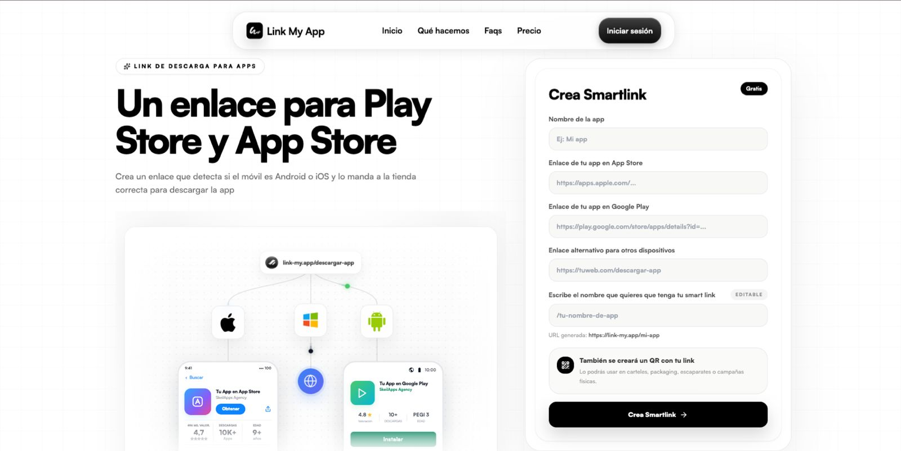

# Link My App — Smart App Download Links

## Summary

Link My App is a simple SaaS-style utility for creating one download link that detects the user's device and sends them to the right app store.

## Problem

App makers often need one clean link for campaigns, QR codes, packaging, bios and landing pages. A normal link usually sends all users to the same destination, even when Android and iOS users need different stores.

## What I built

- Smart link creation flow.
- App Store URL field.
- Google Play URL field.
- Fallback URL for other devices.
- Editable slug.
- QR-friendly download link concept.
- Public open-source repository.

## Stack / skills

- React.
- Firebase.
- Routing.
- Landing page UX.
- Open-source packaging.

## Related repository

[View source code](https://github.com/davidtrotonda/link-my-app)

## Live project

[Open Link My App](https://link-my.app/)

## What I learned

- Small utilities are useful when they solve a very specific distribution problem.
- App marketing workflows often need simple infrastructure around links, QR codes and attribution.

## What I would improve today

- Add analytics per platform.
- Add QR export.
- Add custom domains.
