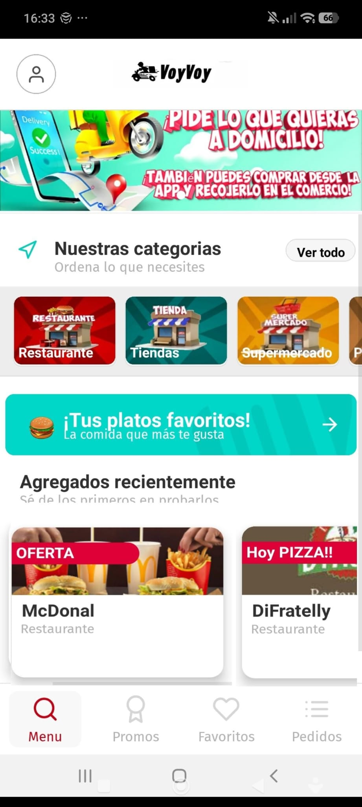

# Local Delivery App — VoyVoy Case Study

## Summary

VoyVoy was a local delivery and ordering app for businesses in Gandia and Oliva. I created it to validate a local marketplace concept and generate funding for servers and ads for Smusix.

## Context

I needed money to cover infrastructure and promotion for Smusix, so I built a delivery app for local businesses and sold it.

## Problem

Local businesses needed a way to receive orders and reach customers through a delivery-style mobile experience.

## What I built

- Local delivery app concept.
- Customer ordering flow.
- Business/category browsing.
- Delivery-style marketplace experience.
- Local business validation.

## My role

- Product.
- Development.
- Sales.
- Local business validation.

## Likely stack / skills

Based on the type and period of the project:

- Mobile app development.
- Marketplace UX.
- Local commerce workflows.
- Business onboarding.
- Product sales.

## Results

- The app was sold.
- The money helped finance servers and advertising for Smusix.

## Source code

The original codebase is not included in this repository. This case study focuses on the product, validation and business outcome.

## What I learned

- Selling a small product can finance a larger product.
- Local marketplaces need supply, demand and operational execution at the same time.
- Product validation can happen through direct sales, not only usage metrics.

## What I would improve today

- Start with a smaller operational area.
- Add clearer merchant onboarding analytics.
- Validate order frequency before expanding categories.

