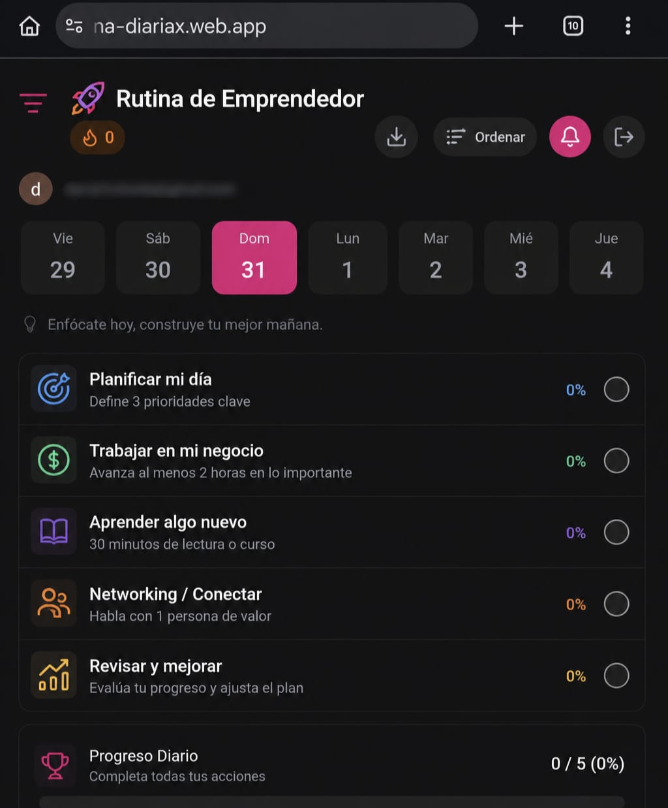

# App de Rutina Diaria — Habit Tracking PWA

## Summary

App de Rutina Diaria is a Firebase-powered routine and habit tracking PWA with authentication, reminders, daily planning and completion tracking.

## Problem

Routine apps often become too generic. This project focused on a clear daily entrepreneur routine, fast mobile use and simple progress visibility.

## What I built

- Firebase Auth login.
- Firestore data sync.
- Daily routine dashboard.
- Calendar/day selection.
- Habit completion tracking.
- Push notification setup.
- PWA install support.
- Firebase Cloud Function for scheduled reminders.

## Stack / skills

- React.
- Vite.
- Firebase Auth.
- Firestore.
- Firebase Messaging.
- Firebase Hosting.
- Cloud Functions.
- PWA/service worker.

## Related repository

[View source code](https://github.com/davidtrotonda/rutina-diaria)

## What I learned

- Mobile-first PWA design can be enough for many personal productivity tools.
- Push notifications require careful service worker and Firebase setup.
- Habit tools need low friction more than complex features.

## What I would improve today

- Add better templates for different user profiles.
- Add analytics for habit completion patterns.
- Improve offline editing and conflict handling.
