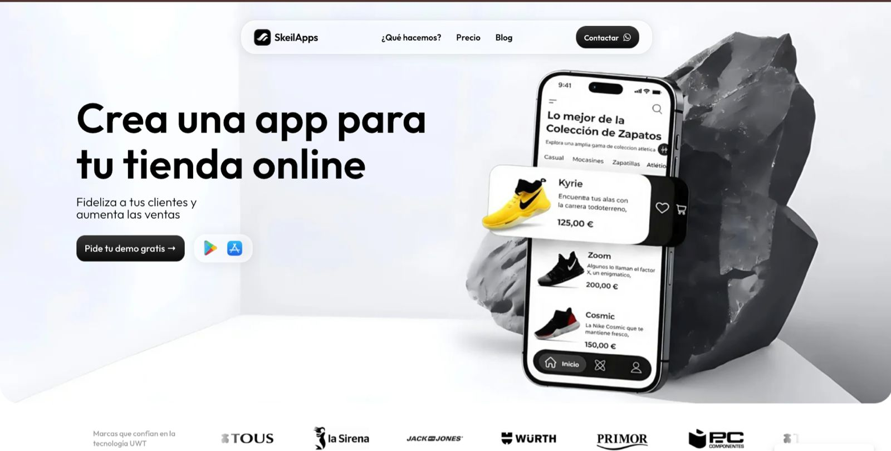

# SkeilApps Automation System — AI Workflow Case Study

## Summary

SkeilApps is my agency project for creating apps for ecommerce businesses. Around it, I started building automation systems to research leads, personalize outreach, manage replies and keep CRM data updated.

## Context

The goal was to make client acquisition and operations more systematic by using AI workflows, n8n automations and CRM updates.

## Problem

Cold outreach for ecommerce services is usually generic. To make it useful, each lead needs business-specific research, personalized context and a clear reason why an app could help that ecommerce grow.

## What I built or started building

- n8n automation to analyze ecommerce businesses.
- Visit, conversion and revenue estimation workflows.
- Research of company news and social posts.
- Hyper-personalized email generation.
- Personalized web page/report for each lead.
- App growth demo and explanatory video flow.
- AI analysis of email replies.
- Lead and conversation status updates in Odoo.
- Interest-level categorization.
- Meeting preparation with all lead context in one place.
- Cancellation email processing and CRM/system updates.

## Stack / skills

- n8n.
- Odoo.
- AI workflows.
- CRM automation.
- Email automation.
- Ecommerce analysis.
- Lead scoring.
- Firebase / web pages / dashboards where relevant.

## Source code

The full automation system is not included in this repository. This case study focuses on the workflow design, systems thinking and product direction.

## What I learned

- AI is most useful when connected to business context and operational systems.
- CRM automation needs careful status design.
- Personalized outbound is stronger when the research is specific and useful.

## What I would improve today

- Add stricter quality checks before sending emails.
- Add analytics for reply quality and conversion by segment.
- Create a dashboard for the full lead pipeline.

