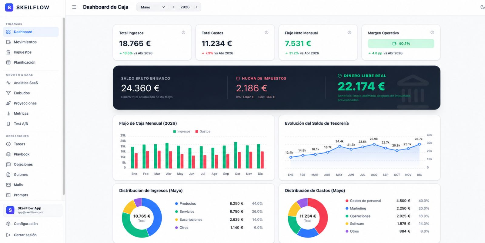

# SkeilFlow — Startup Cashflow Dashboard Case Study

## Summary

SkeilFlow is a cashflow dashboard for startups and small businesses. It helps visualize income, expenses, tax reserves, operating margin and available cash.

## Context

When Firebase Studio and AI-assisted coding tools became useful for building faster, I created a cashflow tool inspired by the type of startup finance spreadsheets used in accelerator environments.

## Problem

Startups often track cashflow in spreadsheets, but it is easy to lose visibility over real cash, tax reserves, monthly runway and growth metrics.

## What I built

- Cashflow dashboard.
- Monthly income and expense tracking.
- Tax reserve view.
- Real available cash calculation.
- SaaS metrics and planning sections.
- Dashboard-style UX.

## Stack / skills

- React.
- Firebase.
- Dashboard UX.
- Financial planning logic.
- AI-assisted development.

## Related repository

[View source code](https://github.com/davidtrotonda/skeilflow)

## What I learned

- Financial tools need clarity more than visual complexity.
- Dashboards should separate real available cash from gross bank balance.
- AI-assisted development can speed up dashboard and SaaS tool creation when the product logic is clear.

## What I would improve today

- Add imports from bank/CSV data.
- Add multi-scenario forecasting.
- Improve onboarding for non-finance users.
