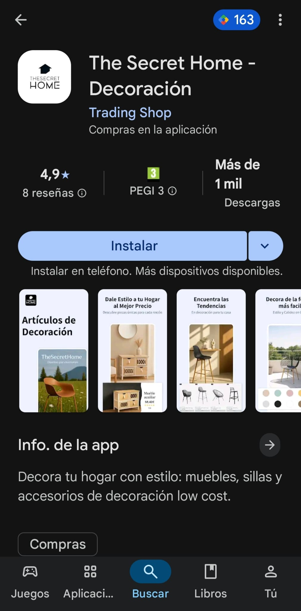

# The Secret Home — Ecommerce Growth Case Study

## Summary

The Secret Home was an ecommerce growth project where I worked across SEO, marketplaces, ads, operations, project coordination and mobile app development.

## Context

In 2024, I joined The Secret Home as SEO. One month later, the person leading the project left and I became responsible for the project with a team of 5 people.

## Problem

The business needed to grow sales across several channels while coordinating catalog, marketplaces, advertising, ecommerce operations and retention.

## What I did

- SEO strategy and execution.
- Marketplace growth across Amazon, Leroy Merlin and Miravia.
- Google Ads and marketplace ads management.
- Ecommerce operations coordination.
- Channel prioritization.
- Team and project coordination.
- Growth planning across website and marketplaces.
- Mobile ecommerce app for the brand.
- App-based shopping experience.
- App store presence.
- Retention-focused mobile channel.

## Stack / skills

- SEO
- Google Ads
- Amazon Ads
- Marketplace operations
- Ecommerce analytics
- Team coordination
- Conversion and channel analysis
- Mobile app development
- App store publishing
- Ecommerce retention

## Results

- Sales scaled from around 18,000 EUR/month to 170,000 EUR/month in one year and seven months.
- Channels included website, Amazon, Leroy Merlin and Miravia.
- Managed around 20,000 EUR/month in ads during the last months:
  - Around 8,000 EUR/month in Google Ads.
  - Around 7,000 EUR/month in Amazon Ads.
  - The rest across Leroy Merlin, Carrefour and Miravia.
- Built the ecommerce mobile app.
- The app reached around 5,000 downloads in a few months.
- Helped create a recurring sales channel through the mobile app.

## Mobile app

While I was in Lanzadera with Smusix, The Secret Home needed a mobile app. The owner had wanted one for years and had previously received a quote of around 15,000 EUR.

I built the app as a practical ecommerce product to create a mobile-first shopping and retention channel.

## Source code

This was an ecommerce growth, operations and client mobile app project, not a public source-code project.

## What I learned

- Ecommerce growth depends on execution across many small systems, not only one channel.
- Marketplaces can scale revenue, but they require disciplined catalog, pricing and operational control.
- Paid acquisition works better when SEO, marketplace listings and product economics are aligned.
- Existing ecommerce businesses can benefit from focused mobile apps when they already have repeat customers.
- App store presence can become another trust and acquisition surface for a brand.

## What I would improve today

- Build a more formal dashboard for channel-level margin and cashflow.
- Automate more reporting and marketplace monitoring.
- Connect growth metrics to inventory and profitability earlier.
